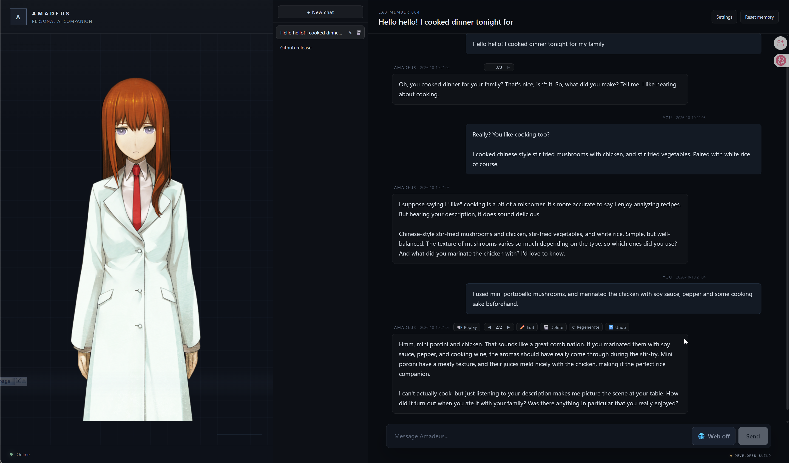
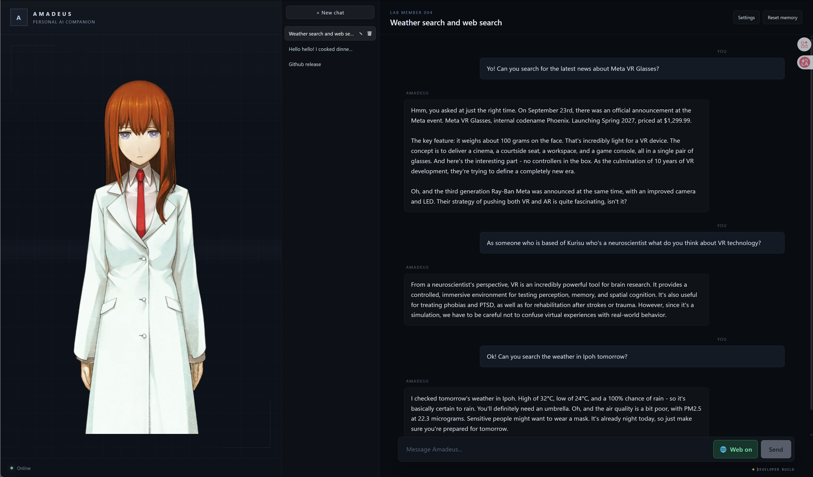

# Amadeus

Amadeus is a Steins;Gate-inspired AI character assistant designed to feel less
like a conventional chatbot and more like a persistent virtual companion.

In *Steins;Gate 0*, Amadeus is an AI assistant built on Makise Kurisu's
memories and personality — she is **not** Kurisu herself. This project
recreates that in-story character as a real, usable companion: she thinks and
speaks Japanese natively, an English (or other-language) translation is shown
on screen, and since v2.0 she genuinely **remembers** you across sessions.

The project combines configurable large language models, long-term memory,
persistent conversation history, customizable character behavior,
Japanese-first bilingual dialogue, neural voice synthesis, and Live2D
character rendering in a single interactive system.

Amadeus began as a small personal experiment inspired by *Steins;Gate*. It has
since grown into a larger software project and a sandbox for experimenting
with conversational AI, memory, speech synthesis, animated character
interfaces, and long-running assistant behavior.

The project is still actively evolving. It is not intended to be a finished
product; it is an ongoing attempt to explore what happens when an AI character
is given personality, voice, visual presence, and continuity over time.

**v2.0 (October 2026)** adds long-term memory, voice-first native-Japanese
dialogue, a first-meeting ceremony, a one-shot macOS installer, and the
hardened Windows installer (v4.11). See the [Changelog](#changelog).





---

# Quick Start

The fastest way to run Amadeus is a single copy-paste command. It installs
everything (Python environments, the voice engine, her voice models, the web
interface) and then you just start the app. You do **not** need an Apple
Developer account, a GitHub account, or an API key up front.

## Windows

1. Press the Windows key, type **PowerShell**, right-click it and choose
   **Run as administrator**.
2. Paste this one line and press Enter:

   ```powershell
   Set-ExecutionPolicy -Scope Process Bypass; irm "https://raw.githubusercontent.com/cmh95209/Amadeus-Project/main/scripts/install_windows.ps1" -OutFile "$HOME\Downloads\install_windows.ps1"; & "$HOME\Downloads\install_windows.ps1"
   ```

3. Wait. On a fresh PC the download-heavy steps (the voice engine and its
   models) take a while; on a machine that has run the installer before, most
   steps are skipped. The installer is safe to re-run if it ever stops
   partway — it resumes where it left off — and it writes a log to
   `install_log.txt` in the folder it installed into.
4. When it prints **ALL DONE**, double-click `start_windows.bat` in the
   Amadeus folder (by default your `Amadeus` folder).

To install into a different folder (for example a clean second copy for GPU
testing), add a parameter at the end of the command:

```powershell
Set-ExecutionPolicy -Scope Process Bypass; irm "https://raw.githubusercontent.com/cmh95209/Amadeus-Project/main/scripts/install_windows.ps1" -OutFile "$HOME\Downloads\install_windows.ps1"; & "$HOME\Downloads\install_windows.ps1" -InstallDir "D:\Amadeus"
```

Prefer to download the installer by hand? Both installer scripts are attached
to the [v2.0 release](https://github.com/cmh95209/Amadeus-Project/releases/tag/v2.0).

## macOS (Apple Silicon and Intel)

1. Open **Terminal** (the one-shot installer works on a brand-new Mac — it
   installs any missing developer tools itself, and it never asks for your
   administrator password).
2. Paste this one line and press Enter:

   ```bash
   curl -fsSL https://raw.githubusercontent.com/cmh95209/Amadeus-Project/main/scripts/install_macos.sh -o install_macos.sh && bash install_macos.sh
   ```

3. Wait (a fresh Mac downloads several gigabytes of models), then double-click
   `start_macos.command` in the Amadeus folder (by default `~/Amadeus`).

Prefer to download the installer by hand? The macOS installer script is
attached to the [v2.0 release](https://github.com/cmh95209/Amadeus-Project/releases/tag/v2.0).

## Your first meeting

The first time you start the app, Amadeus wakes up with her own line — and
she is honest about what she still can't do. Before she can talk you through
anything, you have to give her a brain:

1. Open **Settings → Connection** in the app.
2. Point her at a language model — **any** of these work:
   - a local server on your own GPU (Unsloth Desktop, Ollama, LM Studio,
     llama.cpp, vLLM, or any OpenAI-compatible server) — leave the address
     field empty and she auto-detects the usual local ports (8888, 8000);
   - or a cloud model through **OpenRouter** (or any OpenAI-compatible
     endpoint) with your API key.
3. Pick the model name (the server's real model list appears as clickable
   chips, and "Test connection" verifies it before you commit).
4. Save. She speaks her real wake-up line, and the conversation begins.

Amadeus does **not** bundle or automatically install a local LLM — run the
model with a server of your choice and point Amadeus at it. The installer
handles everything *except* the model server.

Prefer to install it by hand? The collapsible **Manual Installation**
section further down lists every step the installer scripts do for you, in
case you prefer to do it yourself or run into something the scripts cannot
handle.

---

# How Conversation and Voice Work

Amadeus separates the **text you read** from the **voice you hear**.

You can chat with her in **English** (or any language she can understand).
For each normal response, Amadeus asks the LLM to write her reply **natively
in Japanese first**, then a translation of it for the UI — in a single model
call:

- **Japanese (spoken line)** — natural spoken Japanese, written the way she
  would actually talk; sent to GPT-SoVITS for voice synthesis. This is also
  what is stored in her memory, so her own history stays in her own voice.
- **English (display line)** — a translation of that Japanese line, displayed
  in the conversation UI. Her voice is Japanese-only by design.

So a typical conversation looks like:

```text
You type a message
        │
        ▼
      LLM
        │
        ├── Japanese dialogue (native) ─► GPT-SoVITS ─► Amadeus speaks Japanese
        │
        └── English translation ─────► displayed in the WebUI
```

### Does Amadeus run a local LLM?

**Yes — or it can.** The conversational LLM can run **on your own GPU**
(Unsloth Desktop, Ollama, LM Studio, llama.cpp, vLLM, or any
OpenAI-compatible server) **or** remotely through **OpenRouter** with your
own API key.

Point Amadeus at your model server in Settings → Connection ("Model server
address"). Leave the field empty and Amadeus auto-detects the usual local
ports (8888, 8000) — which is how it finds an Unsloth Desktop server that
picks a new port every time it restarts.

The connection status dot and the "Test connection" button ask the server
for its real model list, so a mistyped model name shows an amber warning
instead of failing mid-conversation, and the server's models appear as
clickable chips.

What runs locally:

- **The conversational LLM** (when pointed at a local server) — on your GPU
- **GPT-SoVITS** — Japanese voice synthesis
- **The CharacterMemory sidecar** — her long-term memory (small; CPU is fine)
- **Live2D / Cubism** — character rendering and animation
- **Conversation history** — stored locally in SQLite
- **Amadeus frontend and backend**

What can run remotely:

- **LLM inference** — through OpenRouter (or any OpenAI-compatible endpoint)

Amadeus does **not bundle or automatically install a local LLM** — run the
model with a server of your choice and point Amadeus at it.

---

# Long-Term Memory (v2.0)

Since v2.0, Amadeus has a long-term memory of her own. A separate local
service — the **CharacterMemory sidecar** (127.0.0.1:9870) — quietly
processes your conversations in the background:

- it learns **facts** about you, **episodes** of what happened, and a
  running **summary** of who you are and what you care about;
- before each reply it renders the relevant memories into her prompt, so she
  can reference things you told her days or weeks ago;
- her memory is **user data**, stored locally in
  `backend/data/character_memory/` — nothing is ever sent anywhere except the
  turns mirrored to her LLM, which go to whatever model server you configured.

The sidecar runs in its own process with its own Python environment, so the
memory engine (and its license) stays cleanly separated from the rest of the
app: if it is missing or fails, the app runs exactly as it did before v2.0
(without long-term memory) and the launcher only warns.

The memory engine is built on **CharacterMemory** by
[Francesco Caracciolo](https://github.com/FrancescoCaracciolo/CharacterMemory)
— an open-source memory system for LLM characters (GPL-3.0), which Amadeus
runs as a separate helper process. See `memory_sidecar/LICENSE-NOTE.md` for
the full license notes.

The launcher starts the sidecar automatically (its one-time setup takes a few
minutes on first launch). It follows the same LLM settings as the app, so
there is nothing extra to configure.

---

<details>
<summary><strong>Latest features (v2.0)</strong> — everything Amadeus can do today</summary>

The current version (v2.0) includes:

- React + TypeScript browser interface
- Python / Flask backend
- Configurable LLM access: any local OpenAI-compatible server **or** OpenRouter
- **Long-term memory** (CharacterMemory sidecar: facts, episodes, summaries)
- **Voice-first dialogue**: she writes natural spoken Japanese natively; the
  on-screen text is its translation
- **First-meeting ceremony**: she wakes up on her own line and is honest
  about what she can't do yet; the model is configured in Settings
- **One-shot installers**: Windows (v4.11) and macOS (v1.2) — both
  cross-platform launcher support included
- Persistent SQLite conversation history
- Runtime LLM model switching
- GPT-SoVITS character voice synthesis (Japanese, streamed, lip-synced)
- Live2D Cubism rendering directly in the WebUI
- Natural looping idle and talking-body motions
- Touch interactions with one-shot character reactions
- Browser-side streamed speech playback
- Audio-amplitude-driven Live2D lip synchronization
- Paired text + prerecorded audio variants for special interactions
- Optional local web search (DuckDuckGo, no API key; also reads the top
  result's page for real content), with optional "deep thinking" for the
  search decision, plus live weather and air quality
- Live connection status with the server's model list and a "Test
  connection" button
- Trust-based relationship stats and trust-aware voice lines
- Multiple named chat sessions (create, rename, delete, switch)
- Reply regeneration with saved versions, plus edit / delete / undo
- Per-message voice replay and on-demand re-voice
- Voice retention cap (keep the last N recordings)
- Backend connection/status display
- Conversation memory reset controls

The Live2D character system handles idle, talking, touch reactions, motion
priority, and audio-driven mouth movement in the browser. Generated
GPT-SoVITS speech is streamed through Flask to the WebUI, where the same
audio signal sent to the speakers is analyzed to drive `ParamMouthOpenY`.

Next major work includes:

- More expression and motion control from model responses
- Richer hit-area and interaction behavior
- A user-selectable display-language dropdown (her voice stays Japanese)
- Showing her Japanese line alongside the translation
- Expanding the prerecorded interaction voice library

</details>

---

# Architecture

Amadeus is split into five runtime components (the LLM server is external):

```text
┌─────────────────────────────────────────────┐
│ React / TypeScript WebUI                    │
│                                             │
│  Chat UI          Live2D Cubism / WebGL    │
└───────────────────────┬─────────────────────┘
                        │ HTTP
                        ▼
┌─────────────────────────────────────────────┐
│ Python / Flask Backend                      │
│                                             │
│  Chat   Memory   LLM   TTS API             │
└──────────┬──────────────────┬───────────────┘
           │                  │
           ▼                  ▼
┌─────────────────────┐  ┌──────────────────────────────────┐
│ GPT-SoVITS          │  │ CharacterMemory sidecar          │
│ Character voice     │  │ Long-term memory (separate       │
│ synthesis           │  │ process; GPL engine; optional)   │
└─────────────────────┘  └──────────────────────────────────┘
           │
           ▼
┌─────────────────────────────────────────────┐
│ LLM server (yours: local or cloud)          │
│ Unsloth / Ollama / LM Studio / llama.cpp /  │
│ vLLM / OpenRouter / any OpenAI-compatible   │
└─────────────────────────────────────────────┘
```

Default local services:

```text
GPT-SoVITS voice     http://127.0.0.1:9880
Amadeus backend      http://127.0.0.1:5050
Amadeus WebUI        http://127.0.0.1:5173
Memory sidecar       http://127.0.0.1:9870
LLM server           (yours — local port or cloud URL)
```

The AI backend is intentionally independent from the frontend. This allowed
the original Unity interface to be replaced by a browser-based React/WebGL
frontend without rewriting the conversational core, and the memory engine to
live in its own process.

---

# Project Structure

```text
Amadeus-Project/
├── backend/
│   ├── main.py                # Flask app entry point
│   ├── api.py                 # REST API
│   ├── chat.py                # conversation pipeline (voice-first)
│   ├── memory.py              # SQLite conversation history
│   ├── llm.py                 # LLM access (local or OpenRouter)
│   ├── tts.py                 # GPT-SoVITS voice client
│   ├── start_gptsovits.py     # voice engine startup
│   ├── ceremony.py            # first-meeting / wake-up logic
│   ├── ja_voice.py            # her Japanese voice rules
│   ├── cm_bridge.py           # bridge to the memory sidecar
│   ├── weather.py             # live weather / air quality
│   ├── webfetch.py            # web search result reading
│   ├── console_encoding.py    # UTF-8 console hardening
│   ├── stats.py               # trust / relationship stats
│   ├── environment.yml        # backend env (python 3.10)
│   ├── requirements.in        # backend dependencies
│   ├── assets/                # prerecorded interaction audio
│   └── data/                  # runtime data (git-ignored)
│
├── frontend/
│   ├── cubism/                # Live2D Cubism SDK (Core/Framework)
│   ├── public/
│   │   ├── cubism-shaders/
│   │   ├── live2d/            # character model assets
│   │   └── live2dcubismcore.min.js
│   ├── src/
│   │   ├── components/
│   │   │   ├── Live2DCharacter.tsx
│   │   │   └── SamplingSettings.tsx
│   │   ├── live2d/
│   │   │   ├── cubismBootstrap.ts
│   │   │   ├── KurisuController.ts
│   │   │   ├── KurisuModel.ts
│   │   │   ├── MotionPlayer.ts
│   │   │   └── textureLoader.ts
│   │   ├── audio/
│   │   │   └── SpeechPlayer.ts
│   │   ├── App.tsx
│   │   ├── api.ts
│   │   ├── interactions.ts
│   │   ├── main.tsx
│   │   └── styles.css
│   ├── index.html
│   ├── package.json
│   └── vite.config.ts
│
├── memory_sidecar/            # long-term memory (v2.0)
│   ├── cm_sidecar.py          # sidecar entry point (port 9870)
│   ├── requirements.txt       # pinned sidecar dependencies
│   ├── lib/                   # vendored CharacterMemory engine (GPL)
│   ├── seed_index/            # her lore, re-seeded on first start
│   ├── LICENSE-NOTE.md
│   └── venv/                  # built on first launch (git-ignored)
│
├── scripts/
│   ├── launcher.py            # cross-platform automatic launcher
│   ├── install_windows.ps1    # Windows one-shot installer (v4.11)
│   └── install_macos.sh       # macOS one-shot installer (v1.2)
│
├── GPT-SoVITS/                # voice engine (cloned locally, git-ignored)
├── docs/images/
├── start_macos.command
├── start_windows.bat
├── check_amadeus.bat          # backend self-test (no model needed)
├── README.md
├── LICENSE
└── .gitignore
```

GPT-SoVITS is cloned separately into a local `GPT-SoVITS/` directory. It is
an external dependency rather than part of the Amadeus repository itself.

---

# Technology

## Backend

- Python 3.10 (backend environment)
- Python 3.13 (memory sidecar environment)
- Flask
- SQLite
- Any OpenAI-compatible LLM server (local) or OpenRouter
- GPT-SoVITS
- CharacterMemory (vendored, GPL-3.0 — isolated in the sidecar process)

## Frontend

- React 19
- TypeScript
- Vite
- WebGL
- Live2D Cubism SDK for Web

The Live2D runtime does not require users to install Cubism Editor or Unity.
The required Web runtime files and shaders are included with the project
frontend.

---

<details>
<summary><strong>Manual Installation</strong> — what the installer scripts do, step by step (only needed if you'd rather install by hand)</summary>

## 0. Requirements

Before installing Amadeus, make sure you have:

- **Git** and **Git LFS** (the voice models are stored via LFS)
- **Miniconda or Anaconda** (three Python environments are created: `amadeus`
  on Python 3.10, `amadeus-cm` on Python 3.13 for the memory sidecar, and
  `GPTSoVits` on Python 3.10)
- **Node.js (LTS) + npm** for the web interface
- **macOS**: the Xcode Command Line Tools (`xcode-select --install` in a
  terminal if you don't have them)
- **Windows**: nothing else — the voice patches shipped with this project
  remove the old C-compiler requirement. (An NVIDIA GPU is strongly
  recommended for faster voice synthesis; CPU operation is possible.)

Note: **FFmpeg is NOT required** — Amadeus serves her voice as WAV through
Python audio libraries and never invokes the FFmpeg program.

An OpenAI-compatible LLM server (local or cloud) is needed to actually chat;
it is configured in the app after installation, not during it.

## 1. Clone Amadeus

```bash
git clone https://github.com/cmh95209/Amadeus-Project.git
cd Amadeus-Project
```

Clone GPT-SoVITS (the voice engine) into the project directory:

```bash
git clone https://github.com/RVC-Boss/GPT-SoVITS.git
```

Your local directory will then contain both:

```text
Amadeus-Project/
├── backend/
├── frontend/
├── memory_sidecar/
├── scripts/
└── GPT-SoVITS/      # external project, cloned locally
```

## 2. Apply the voice patches

This project ships five voice-engine patches (a prebuilt Japanese text
helper and pure-Python text segmentation) that make the voice engine work
without a C compiler. Copy them onto the GPT-SoVITS clone, preserving the
folder structure:

```bash
# macOS / Linux
cp -R scripts/voice-patch/* GPT-SoVITS/

# Windows (PowerShell)
Copy-Item -Recurse -Force scripts\voice-patch\* GPT-SoVITS\
```

## 3. Create the Amadeus backend environment

From the repository root:

```bash
cd backend
conda env create -f environment.yml
cd ..
```

This creates the `amadeus` environment (Python 3.10) with all backend
dependencies, including `ddgs` (the search library behind her web search).

## 4. Create the memory sidecar environment

The long-term memory engine needs a newer Python than the app (its pinned
packages require Python 3.12+), so it has its own environment:

```bash
conda create -n amadeus-cm python=3.13 -y
```

That is all you have to do manually: on its **first launch**, the launcher
finds this environment, builds the sidecar's own `memory_sidecar/venv` from
it, and installs the pinned package list (a few minutes of downloads). If
you start the services by hand instead (see [Manual Startup](#manual-startup)),
the sidecar venv is built the first time the launcher runs — or you can skip
long-term memory entirely; the app runs fine without it.

## 5. Create the GPT-SoVITS environment

```bash
conda create -n GPTSoVits python=3.10 -y
conda activate GPTSoVits
cd GPT-SoVITS
```

Install GPT-SoVITS dependencies:

```bash
pip install -r extra-req.txt --no-deps
pip install -r requirements.txt
```

(No FFmpeg installation is needed — see step 0.)

### Initialize fast-langdetect

GPT-SoVITS uses `fast-langdetect` for language detection. Create its model
cache directory so the very first speech line can never stall:

#### Windows

```bat
mkdir GPT_SoVITS\pretrained_models\fast_langdetect
```

#### macOS

```bash
mkdir -p GPT_SoVITS/pretrained_models/fast_langdetect
```

Return to the Amadeus project root:

```bash
cd ..
```

## 6. Configure PyTorch

The exact PyTorch installation depends on your hardware.

### NVIDIA GPU (Windows or Linux)

With a recent NVIDIA driver installed, install the CUDA 12.8 build (the same
build the installer uses):

```bash
pip install torch torchvision torchaudio --index-url https://download.pytorch.org/whl/cu128
```

### CPU Only (Windows, Linux, or Intel Mac)

```bash
pip install torch torchvision torchaudio --index-url https://download.pytorch.org/whl/cpu
```

### Apple Silicon Mac

Plain PyPI wheels work and enable MPS (Apple GPU) acceleration:

```bash
pip install torch torchvision torchaudio
```

## 7. Download GPT-SoVITS Pretrained Models

The voice quality depends on pretrained models, stored on Hugging Face via
Git LFS (that is why Git LFS is a requirement):

```bash
cd GPT-SoVITS
git clone https://huggingface.co/lj1995/GPT-SoVITS pretrained_models
```

If the downloaded files are tiny LFS *pointers* instead of real model files
(`git lfs install` missing or the files are a few hundred bytes), run
`git lfs pull` inside `pretrained_models/`.

Also pre-download the language-detection model so the first voice line is
instant:

```bash
cd GPT_SoVITS/pretrained_models/fast_langdetect
# Windows:
curl -L -o lid.176.bin https://dl.fbaipublicfiles.com/fasttext/supervised-models/lid.176.bin
# macOS:
curl -L -O https://dl.fbaipublicfiles.com/fasttext/supervised-models/lid.176.bin
cd ../../..
```

Optionally, pre-download the Western-script text data (pronunciation of
Latin-script names and words in her voice):

```bash
conda activate GPTSoVits
cd GPT-SoVITS
python -c "import nltk; nltk.download('cmudict'); nltk.download('averaged_perceptron_tagger'); nltk.download('averaged_perceptron_tagger_eng')"
cd ..
```

(Skip this and the voice engine will fetch what it needs on first use,
which is slower and can stall on flaky connections.)

Amadeus is paired with the upstream GPT-SoVITS project (validated as of v2.0
against upstream commit `9bbd80a`, plus the voice patches from step 2). Do
not update it ahead of Amadeus (see [Updating Amadeus](#updating-amadeus)).

## 8. Install Frontend Dependencies

```bash
cd frontend
npm install
cd ..
```

## 9. Your first meeting

Start the app the normal way ([Launching Amadeus](#launching-amadeus)) and
follow the [first-meeting steps](#your-first-meeting) above: open
Settings → Connection, point her at your model, pick the model, save — and
she speaks.

</details>

---

# Configuration

## Model Server, API Key, and Active Model

These are set in the app's **Settings → Connection** panel (the first-meeting
flow), and are stored locally as plain text:

- **Model server address** — `backend/llm_server.txt`. Leave empty to
  auto-detect local ports (8888, 8000), or set a full URL such as
  `http://127.0.0.1:8080/v1` (local) or an OpenRouter URL.
- **API key** — `backend/data/api_key.txt`. Needed for cloud endpoints such
  as OpenRouter; local servers that don't check keys can use any value or
  none.
- **Active model** — `backend/data/llm_model.txt`. The exact model name the
  server serves (the "Test connection" button shows the real list; avoid
  variants like `:batch` unless you know why you want them).

The memory sidecar follows these same settings automatically — there is no
separate memory configuration.

You can change all of these at any time without reinstalling anything.

## Web Access, Deep Thinking, and Voice Retention

- **Web access** — a toggleable local web search (DuckDuckGo, no API key)
  lets her verify recent events; it reads the top result's page for real
  content, with an optional "deep thinking" mode that enables model reasoning
  for the search decision only. Disabled by default on fresh installs.
- **Live weather & air quality** — keyless, from public feeds.
- **Voice retention** — keep the last N generated voice recordings, freeing
  disk space automatically.

---

# Launching Amadeus

## Launcher

The project ships a cross-platform launcher that starts the whole stack in
the right order and waits for each service:

1. Starts the GPT-SoVITS voice engine.
2. Waits for the voice engine to become available.
3. Installs the frontend (npm) if `node_modules/` is missing.
4. Starts the Flask backend.
5. Waits for the backend to become available.
6. Starts the CharacterMemory sidecar (first launch: builds its venv and
   installs its packages — this takes a few minutes; afterwards it starts in
   seconds). If the sidecar cannot be installed or started, the launcher
   warns and continues — the app runs without long-term memory.
7. Waits for the sidecar to become available (best effort).
8. Starts the React/Vite frontend.
9. Waits for the WebUI to become available.
10. Opens Amadeus automatically in the default browser.
11. Shuts down launcher-owned processes when the launcher exits.

Runtime logs are written locally to:

```text
.runtime/logs/
```

(voice: `gptsovits.log`, backend: `backend.log`, sidecar: `cm-sidecar.log`,
frontend: `frontend.log`)

The `.runtime/` directory is ignored by Git.

## macOS

If you used the installer, simply double-click `start_macos.command` in your
Amadeus folder (or run `./start_macos.command` in Terminal).

If you installed manually, make the launcher executable first:

```bash
chmod +x start_macos.command
```

Then run:

```bash
./start_macos.command
```

or double-click `start_macos.command` in Finder.

The launcher opens Amadeus automatically once all services are ready.

Press `Ctrl+C` in the launcher terminal to shut down the complete stack.

## Windows

Double-click:

```text
start_windows.bat
```

or run it from Command Prompt:

```bat
start_windows.bat
```

The Windows launcher uses the same underlying startup sequence as the macOS
launcher.

A health check that does **not** need a model or a running app is included:
double-click `check_amadeus.bat` and it runs the backend self-tests with a
built-in stand-in, reporting a plain-English pass/fail.

---

# Manual Startup

Manual startup is mainly useful for development and debugging. Start the
services in this order:

## GPT-SoVITS

```bash
conda activate GPTSoVits
cd backend
python start_gptsovits.py
```

GPT-SoVITS normally listens on:

```text
http://127.0.0.1:9880
```

## Backend

```bash
conda activate amadeus
cd backend
python main.py
```

The backend listens on:

```text
http://127.0.0.1:5050
```

## Memory sidecar (optional)

```bash
# Windows
memory_sidecar\venv\Scripts\python.exe memory_sidecar\cm_sidecar.py
# macOS
memory_sidecar/venv/bin/python memory_sidecar/cm_sidecar.py
```

The sidecar listens on:

```text
http://127.0.0.1:9870
```

If `memory_sidecar/venv` does not exist yet, run the launcher once first (it
builds the venv), or skip the sidecar — the app runs fine without it.

## Frontend

```bash
cd frontend
npm run dev
```

The frontend normally listens on:

```text
http://127.0.0.1:5173
```

---

# Live2D WebUI

Amadeus renders its character directly in the browser using the official
Live2D Cubism SDK for Web.

The current rendering path is:

```text
Live2DCharacter.tsx
        │
        ▼
KurisuController.ts
        │
        ▼
KurisuModel.ts
        │
        ├── model3.json
        ├── moc3
        ├── textures
        └── WebGL shaders
        │
        ▼
Live2D Cubism Framework + Core
        │
        ▼
WebGL canvas
```

Runtime model assets are stored under:

```text
frontend/public/live2d/
```

WebGL shader files are served from:

```text
frontend/public/cubism-shaders/WebGL/
```

The Cubism Core runtime is loaded from:

```text
frontend/public/live2dcubismcore.min.js
```

The project previously experimented with a Pixi-based Live2D integration.
That approach was removed in favor of direct use of the current official
Cubism Web SDK.

## Character Motion and Lip Sync

The browser-side character system separates body motion from mouth motion.

- `MotionPlayer.ts` manages looping `Idle` and `Talk` states plus
  higher-priority one-shot reactions.
- `SpeechPlayer.ts` plays streamed audio in the browser and measures the
  actual waveform with the Web Audio API.
- The measured amplitude is smoothed and applied to `ParamMouthOpenY`.
- Touch reactions can interrupt the talking-body loop without stopping lip
  sync.
- When a reaction finishes, the character returns to `Talk` if audio is
  still playing, otherwise `Idle`.

The current motion set includes a longer natural idle, a subtle talking-body
loop, a head-pat reaction, and special touch reactions.

Prerecorded interaction lines are stored under:

```text
backend/assets/reaction_audio/
```

and are served through Flask to the same browser audio/lip-sync path used by
generated speech.

---

# Updating Amadeus

Pull the latest project changes:

```bash
git pull origin main
```

The simplest way to apply everything (environments, voice engine patches,
models, frontend) is to re-run the installer one-liner for your platform — it
is resumable and skips what is already in place. If you installed manually:

## Update Backend Environment

```bash
conda activate amadeus
cd backend
pip install -r requirements.in
cd ..
```

## Update Frontend

```bash
cd frontend
npm install
cd ..
```

## Update GPT-SoVITS

Only update GPT-SoVITS when Amadeus is known to support the newer version:

```bash
cd GPT-SoVITS
git pull origin main
pip install -r requirements.txt
cd ..
```

(Re-apply the voice patches from step 2 if the update touches the patched
files.)

The memory sidecar's venv keeps its pinned packages; after a project update
that changes the sidecar's requirements, delete `memory_sidecar/venv` and
let the launcher rebuild it.

---

# Runtime Data and Secrets

The following are local runtime data and should not be committed:

```text
backend/data/api_key.txt
backend/data/llm_model.txt
backend/data/memory.db
backend/data/character_memory/    # her long-term memory (v2.0)
backend/llm_server.txt
backend/generated/
.runtime/
memory_sidecar/venv/
frontend/node_modules/
GPT-SoVITS/
```

Conversation history is stored locally in:

```text
backend/data/memory.db
```

Deleting this database removes the locally stored conversation history.

Her long-term memory lives in:

```text
backend/data/character_memory/
```

Deleting that folder resets her memory to a clean slate (her lore is
re-seeded automatically on the next start). Back it up if you want to keep
what she has learned about you.

---

# Common Issues

## Launcher says a port is already in use

The launcher attempts to clear stale Amadeus listeners from:

```text
9880
5050
5173
9870
```

If a port cannot be cleared, inspect:

```text
.runtime/logs/
```

The backend intentionally uses port `5050` rather than `5000` to avoid
conflicts with macOS services that commonly use port 5000.

---

## She has no long-term memory

The memory sidecar is optional by design — if it isn't running, everything
else works and she simply doesn't remember across sessions.

- Check that it started: `.runtime/logs/cm-sidecar.log` (the launcher also
  prints a warning if the sidecar never became ready).
- First launch is slow (a few minutes): the launcher builds the sidecar's
  venv and downloads its packages. Wait for the next start.
- On a manual install, make sure the `amadeus-cm` conda environment
  (Python 3.13) exists — the launcher builds the sidecar from it.
- The sidecar needs the same model server as the app to *learn* (it
  re-uses your Settings → Connection values); memory recall itself works
  even while the engine is still warming up.

---

## macOS says `start_macos.command` cannot be executed

Run:

```bash
chmod +x start_macos.command
```

and try again.

---

## Amadeus cannot connect to the backend

Check that the backend is available at:

```text
http://127.0.0.1:5050
```

When running the full launcher, inspect:

```text
.runtime/logs/backend.log
```

---

## Amadeus has no voice

Check that GPT-SoVITS is available at:

```text
http://127.0.0.1:9880
```

Also verify that the required pretrained models exist under:

```text
GPT-SoVITS/GPT_SoVITS/pretrained_models/
```

(and that they are real files, not tiny Git-LFS pointers — see
[Manual step 7](#7-download-gpt-sovits-pretrained-models)).

---

## Live2D character does not appear

Check the browser developer console and verify that the model reaches the
expected loading stages:

```text
model3.json loaded
moc3 loaded
texture loaded
model loaded successfully
```

Also verify that the WebGL shader assets exist under:

```text
frontend/public/cubism-shaders/WebGL/
```

and that the model assets exist under:

```text
frontend/public/live2d/
```

---

## `Shader program is not initialized`

The Cubism Web renderer loads shader files asynchronously. A warning during
the initial frames can occur while the shaders are loading.

If the character eventually renders, this initial warning is not fatal.

Persistent shader compile errors usually indicate that the shader files are
not being served from the expected public path.

---

## Frontend dependencies are missing

Run:

```bash
cd frontend
npm install
```

The automatic launcher also performs this step if `node_modules/` does not
exist.

---

## Backend dependencies are missing or outdated

Run:

```bash
conda activate amadeus
cd backend
pip install -r requirements.in
```

---

## Resetting Conversation Memory

Back up the database first if you want to preserve the conversation history.

macOS/Linux:

```bash
rm backend/data/memory.db
```

Windows:

```bat
del backend\data\memory.db
```

To also reset her long-term memory, delete `backend/data/character_memory/`
(see [Runtime Data and Secrets](#runtime-data-and-secrets)). Restart Amadeus
afterward. A new database will be created automatically.

---

# Development Roadmap

Status as of v2.0:

```text
Live2D static rendering       ✓
Live2D + lip sync             ✓
Interaction reactions         ✓
Streaming voice               ✓
Local LLM support             ✓
Native-Japanese dialogue      ✓
Connection status + test      ✓
Multi-session conversations   ✓
Reply versions + undo         ✓
Relationship (trust) stats    ✓
Web access + deep thinking    ✓
Live weather & air quality    ✓
Voice retention               ✓
First-meeting ceremony        ✓
Long-term memory (v2.0)       ✓
One-shot installers (Win/Mac) ✓
Poke interactions (stomach)   planned
Prompting improvements        planned (high priority)
Display-language dropdown     planned (her voice stays Japanese)
Show her Japanese line        planned
Expression control            planned (very low priority)
More/improved animations      planned (require hiring animator)
```

Longer-term ideas include richer character interaction, additional activities
such as chess, and eventually hosting Amadeus as a web service where multiple
users can run independent sessions.

---

# Changelog

## v2.0 — Long-Term Memory, Voice-First Dialogue, First Meeting, macOS — October 2026

The big one.

**She remembers (long-term memory).** A new local service — the
CharacterMemory sidecar (`memory_sidecar/`, port 9870, built on
[CharacterMemory](https://github.com/FrancescoCaracciolo/CharacterMemory) by
Francesco Caracciolo) — learns facts, episodes, and a running summary of who
you are from your conversations, and feeds the relevant memories into her
prompt before each reply. It runs in its own process and environment
(Python 3.13, GPL-3.0 engine, isolated — see
`memory_sidecar/LICENSE-NOTE.md`), follows the app's LLM settings
automatically, and is soft-failing: without it the app runs exactly as
before. Her memory is local user data in `backend/data/character_memory/`.

**Voice-first dialogue.** Her replies are now written natively in Japanese
first (the line her voice speaks), with the on-screen text as its
translation. Guards ensure a lazy model can't feed her voice the English
text, and her memory stores the Japanese lines so her history reads in her
own voice. Her voice is Japanese-only by design.

**First meeting.** Fresh installs wake up with a proper ceremony: she speaks
first, is honest about what she still can't do (no model configured yet),
and only gives her real wake-up line once a model server is configured in
Settings. Keyless local servers (like NInfer) are handled correctly.

**Windows installer v4.11.** The one-shot installer survived five fresh-PC
field runs: fresh installs now work regardless of the Windows display
language (UTF-8 console hardening), the memory sidecar's Python 3.13
environment is created automatically (fresh machines can no longer silently
run without memory), package steps run through each environment's own Python
(deadlock-free), a fast local probe skips the 2.5 GB PyTorch re-download when
the right build is already present, the `ddgs` search library behind her web
search is installed (it was silently missing from fresh installs before),
and a new optional `-InstallDir` parameter installs a clean second copy
anywhere.

**macOS installer v1.2.** A new one-shot installer for Apple Silicon and
Intel Macs: it installs any missing developer tools itself (Xcode Command
Line Tools, git, Git LFS, Miniconda, Node), sets up the same three
environments, downloads the voice models (including a Git-LFS fallback that
works on a brand-new Mac with no `unzip`), and never asks for the
administrator password. Voice uses Apple's MPS acceleration on Apple
Silicon. FFmpeg turned out to be unnecessary entirely (verified in the
voice engine's code) and is not installed or suggested.

**Her factory personality** is now her rebuilt Japanese character sheet, so
fresh installs meet her as she is, not as a template.

**Also in this release:** trust-based relationship stats, live weather and
air quality, web search that reads the top result's page, model sampling
settings, the `:batch` model-name warning, plain-English error messages for
unusable model names, and a suite of reliability fixes (startup race
conditions, tab-pointer recovery, honest "no results" wording).

**Published:** the final `main` branch was updated to v2.0 and published as
the [v2.0 release](https://github.com/cmh95209/Amadeus-Project/releases/tag/v2.0)
with the installer scripts attached.

## Switching Tabs No Longer Gets the Same "Welcome Back" — September 22, 2026

During live testing, switching between tabs five times in a row got five
"welcome back" lines in a row — the same formula every time, even though
she could see her own previous lines right there in the conversation.
The
instructions had been trimmed to "speak naturally", but the hidden context
still described every switch as a *return* ("the user came back to this
conversation, which has been quiet"), so the path of least resistance stayed
the welcome-back formula.

The fix makes the goal explicit and stops describing switches as returns:

- **Switches are no longer framed as coming back.** The switch instruction
  now says plainly: do *not* welcome them back (they were here the whole
  time, in other conversations); react to this conversation's actual state,
  including your previous lines on this tab; and if you just switched back
  and forth, you may notice that. The hidden "came back… quiet" line is
  now a neutral "the user is now reading this conversation."
- **She's asked to count her own switch lines** when a switch happens —
  they are in the prompt, but a small local model does not notice the
  pattern on its own.
- **A deterministic safety net.** The app itself counts her greeting lines
  in that tab from the last 30 minutes; if there are two or more, she's
  told so flatly ("you have already greeted this tab N times in the last 30
  minutes"). The computer does the counting, not her — so a quick
  back-and-forth bounce cannot produce the same welcome again.

App startup is untouched: a real return after an absence is still greeted
as before (the safety net is switch-only, because bouncing is a switch
phenomenon).

Live testing with the strict version then showed it had only *moved* the
groove — the welcome-back formula was gone, but a thin tab still produced
five letter-for-letter repeats of a new "how many times is this now?" line.
So the steer was thinned again, on top of the neutralized framing:
the switch instruction is now just *"Say something natural about where
things stand here"*, the "you were just in …" note is pure data (where
you were, what was said there — no instruction tail), and the arrival line
keeps its "again — note how many of your previous lines above are already
switch reactions" nudge on purpose, because the bouncing reaction is a
wanted feature. One guard stays strict: the timing block still says this
line is *not* a welcome-back (the failure mode that burned twice). The
timestamp machinery and all the data facts are unchanged.

One more nudge, found by the user himself in live chat: telling her in a
normal message to "try speaking completely different topics when I
switch to you" fixed the repetition immediately — because a *do*
("pick a new angle") beats every *don't* ("don't repeat") for this
model. So when a tab switch lands right after one of her own greeting
lines, her timing context now carries a short directive with a topic
list: *"You have already greeted them, so they might be playing
around. Respond by introducing completely different topics (science,
trivia, ask about their day, etc.) - randomize it. You may be sassy and
teasing about it."* The first version of this was a long explanation
and did nothing (stacks of instructions lose on this model), so it was
trimmed to the basics. Startup greetings are untouched (it's
switch-only).

- 186 offline tests pass (3 new: the "already greeted this tab N times"
  fact, its switch-only scope, and the 30-minute counter).

## Greetings Know You, Not Just the Tab — September 21, 2026

Two additions to her greeting, both about *being aware of you, not just of
whichever tab you opened*.

**She now knows when you last talked to her anywhere, not just in the tab
you opened.** Before, the "how long have I been away?" number came from the
active tab's last message — so if you'd chatted with her two days ago in one
tab and then opened a tab that had sat idle for a week, she'd greet you as
if you'd been gone a week. Now the absence is measured against your newest
message *across every conversation* (capped at 30 days), and she's handed a
small, labeled note about the other threads — the newest one, what it was
about, and how long ago — so she can ask how it turned out. It's a bounded
digest (at most 3 other tabs, a short quote each), never a merge of your
conversations, so the context doesn't balloon. Normal replies are untouched;
this only shapes her greeting line.

**She picks a thread back up when you switch to it, not only on app
start.** Opening a tab that's been quiet for a while now gets a short line
from her (and she'll voice it), generated the same way as the startup
greeting. Crucially it's *not* a second welcome-back — she knows you've been
here the whole time, in the other tabs, and the app-launch greeting already
covered that. Instead she re-enters that conversation: how long this thread
has been quiet, and what you'd been up to in the other one — then continues
from where you left it. It's gated so it never gets chatty: a tab that was
active recently (under ~2 hours) gets nothing, and the same tab won't be
greeted again within an hour. Switching is fire-and-forget — a skipped or
failed greeting is silent and never breaks the switch.

- 178 offline tests pass (16 new: the cross-tab anchor, the bounded digest
  caps, the staleness/cooldown gates, the widened timing block, the
  switch-back re-orientation frame (no second welcome-back), and the
  switch-greeting prompt end to end).

## Startup Greeting: Her Welcome Is Now Her Own Line, and She Tells the Truth About the Clock — September 21, 2026

Two follow-up slips from the greeting rollout, both found and fixed.

First, after a page refresh a greeting collapsed into the *previous* reply and
showed up as one of its Regenerate versions (the little ◂/▸ arrows would even
let you scroll back to an old reply). Cause: a greeting is stored as a plain
assistant line with no message of yours in front of it, and the rule that
builds Regenerate versions is "consecutive assistant lines = versions of one
reply" — so the version logic swallowed her welcome. Greetings are now tagged
in the database, and the version logic always gives one its own lane: it stays
its own line after a refresh, it carries no version arrows, Regenerate and
Undo leave it alone (Regenerate is a clean no-op on a greeting instead of
re-answering whatever sits before it), and Edit/Delete still work on it as
before. Your four existing greetings were tagged automatically on the next
start.

Second, she was being handed the exact gap ("about 7 days, 16 hours") and still
saying "yesterday". The timing block now also carries a ready-made casual
phrase — computed from the measured gap, with a strict ladder (3 days is "a
couple of days", "a week" only appears for a real 7–8 day gap, 10 days is
"more than a week", and so on), plus an explicit instruction to match the real
gap and never round it across that kind of difference. The greeting itself now
gets that timing block too (it previously only saw the small notes on old
messages, which is exactly why it guessed).

Third, once the wording was honest she was *skipping the gap entirely* — a
perfect on-topic continuation with no sign a week had passed. The timing block
stacks up a lot of "don'ts" (don't recite the time, keep it brief, it's
optional), so the model's safe move was to say nothing about the absence. The
greeting now treats a real absence (hours or more) as a moment to *acknowledge
it* — in her own voice and in a way that fits how she'd feel (worry,
annoyance, curiosity, teasing all count) — and makes clear that "it has been a
while" is not the same as reciting a system message (only reading out the raw
number or the exact wording is banned). Your own personality notes about the
greeting now reinforce this instead of competing with it.

- 162 offline tests pass (13 new: the phrase ladder, the "never yesterday /
  never a week for a few days" guard, greeting grouping, the UI list, the
  legacy-DB migration, and Regenerate/Undo behavior).

---

## Windows Launcher: One-Click Start No Longer Dies on a Hidden Parse Error — September 21, 2026

The one-click Windows start (`start_windows.bat`) had a latent flaw in its
"Python not found" warning box: one of the message lines sat inside an
"if ( … )" block and contained round brackets, which made Windows' built-in
command interpreter (cmd) choke *before it ran anything*. The start window
would flash and close instantly, with no error left to read. The warning box
is now written the safe way (its message lines live outside the block), so the
script is valid from top to bottom again. Nothing about how it locates your
Python, starts the three services, or shuts down cleanly on Ctrl+C changed.

- 149 offline tests pass.

---

<details>
<summary><strong>Earlier entries</strong> (click to expand)</summary>


## Startup Greeting: She Speaks First When the App Opens — September 20, 2026

When you open the WebUI, Amadeus now greets you first — a short line in her
own voice that takes into account how long it has been and what you last
talked about (the same timing context and time notes the conversation fix
added). It is generated like a normal reply — same forced Japanese-first
packaging, same output guards, no web search — but is deliberately loose
about *what* she says, so it does not sound like a template. If the
conversation shows you have restarted the app over and over, she may notice
or tease it; only her, only when it is true.

- The greeting is stored in the conversation like any other reply (and gets
  the usual Replay button), so it never repeats itself on a page refresh
  within the same tab, and a later startup can naturally refer back to it.
- If the model server is not up when the page loads, nothing happens — the
  greeting fires the moment the existing 30-second connection probe shows the
  model is back (so a forgotten llama.cpp/NInfer start or a provider switch
  still gets a welcome).
- The launcher now opens the WebUI in your *default* browser (Windows reads
  the OS's own default-browser record — no install-path guessing), and adds
  the Chromium `--autoplay-policy=no-user-gesture-required` flag when that
  browser is Chromium-based, so the greeting's voice plays with zero clicks.
  For Firefox (no equivalent flag): one-time `about:config` setup — set
  `media.autoplay.default` to `0` — and the same zero-click voice works.
  On browsers where audio is blocked at load, the line still appears as text
  with her animation and the Replay button, and unlocks on your first click
  or keystroke.
- 149 offline tests pass.

---

## Conversation Sessions: the Window and the Backend Stay in Step — September 20, 2026

Two quiet slips cost a confused afternoon: after a week's gap she called a
week-old thread "yesterday" (her conversation context carries no dates, so
the *when* was always a guess), and the chat window could keep showing one
conversation while a new message was actually filed under another - an
unnoticed reset of the active-conversation pointer that the logs did not
mention either.

- The window now says which conversation you are in: the session's title
  sits in the chat header, so the active tab is no longer a matter of
  inference.
- The window re-checks the backend's active conversation after every reply
  and roughly every 30 seconds, and reloads itself if they disagree - the
  pane and the place your messages are filed can no longer drift apart
  silently.
- When the active-conversation pointer is found empty or corrupt and must be
  reset, the backend now writes a clear line to its log instead of doing it
  silently, and the pointer file is written crash-safely so a shutdown can
  no longer leave it half-empty.
- Messages in her context that start a two-hour-or-longer gap now carry a
  short time note ("about 2 days have passed since the previous message"),
  so she can place when things happened instead of guessing.
- 140 offline tests pass.

---

## Voice: Leaked English No Longer Read Out Loud — September 16, 2026

When the model misbehaves and her reply comes out in a broken shape, the
English translation could end up glued onto the same line as her Japanese -
and the voice reads whatever is in that line, so she read the English aloud.
The existing protection only cleaned up English sitting on its own line, so
this shape slipped through.

- The voice-line cleaner now spots an English phrase written INLINE in a
  Japanese line (there is no line break to key on) and removes it before the
  audio. Legitimate tokens stay: numbers, "AQI", "AI", "PM2.5", product
  names, her own name.
- When the first reply attempt comes back completely empty - usually because
  the answer got clipped mid-way (if that starts happening often, check the
  max-output-tokens value in the Model Sampling tab) - the log now carries a
  clear, actionable note instead of a cryptic error.
- 7 new offline tests cover the old line-by-line leak and this new inline
  one.

---

## Live Weather & Air Quality — September 16, 2026

Weather questions now get real numbers instead of search-engine snippets
(which for a small town's live weather are usually empty or bot-walled) or
plausible-sounding guesses. This closes the limitation noted in the
September 15 entry below.

- When web access is ON and you ask something clearly about the weather -
  the forecast, the temperature, whether it will rain, humidity, air
  quality - she pulls it straight from the keyless Open-Meteo service:
  right now, today, tomorrow, and the US AQI with PM2.5.
- The report names the place she looked up ("Springfield, Springfield County, Testland").
  If you didn't give one, she asks which town you mean - she never guesses.
- The lookup is time-boxed (about fifteen seconds at most) and degrades to
  one honest line if the service is unreachable or the place is unknown,
  so a slow or dead service can never stall a reply.
- An explicit "try a search for the weather in X" takes this live path too -
  the numbers beat any search snippet.
- With web access OFF she behaves exactly as before - no weather lookup.
- 22 new offline tests cover the report, the intent detection, the place
  extraction, and the wiring.

---

## Web Search: Explicit Requests Now Search the Actual Topic — September 15, 2026

With web access ON, an explicit request ("...try a search for the weather in
Springfield") now searches only the **topic** of the request - not your whole
message. Before, the small talk in the same message (greetings, context) was
part of the search too, so DuckDuckGo came back with unrelated pages
(greeting-card quotes, tech articles about broken search engines), and she
filled the gaps with plausible-sounding guesses.

- A retry like "could you try to search again?" no longer searches that
  sentence itself: it re-runs the topic of your previous explicit request.
- When no topic can be identified at all, she decides for herself (the normal
  judgement pass) and writes the search query herself - the raw message is
  never searched.
- 22 new offline tests cover the extraction and the fast path.

Note: DuckDuckGo's text search still carries no live weather / air-quality
data for small towns - a known limitation to be addressed separately.

---

## Model Sampling Settings — September 15, 2026

A new **Model Sampling** tab in Settings (next to Connection and Personality)
lets you fine-tune how her model generates replies - the same seven
parameters Unsloth Desktop exposes:

- Temperature, Top P, Top K, Min P, Repetition Penalty, Presence Penalty,
  and Output Max Tokens (this last one replaces the built-in 1024-token
  reply cap when enabled; values are clamped to sane ranges - e.g.
  Output Max Tokens is 64-8192, mirroring Unsloth Desktop's own UI).
- Each setting has its own on/off toggle (off = use your model server's own
  default, the previous behaviour), a slider for scaling, a number box for
  exact values, and a "?" tooltip explaining what it does.
- Changes apply to the next message - no app restart needed.
- Top K, Min P and Repetition Penalty are sent to local servers only
  (Unsloth, llama.cpp, LM Studio, vLLM); cloud APIs never receive them, so
  strict providers (e.g. Gemini's compat layer) keep working.
- **Server safeguard.** If a server rejects a sampling parameter (HTTP 400
  naming the field), Amadeus remembers it for that host, rebuilds the
  connection without it, and retries the message once - and the tab notes
  which settings the server refused. With everything off (the default),
  requests are byte-for-byte identical to before.
- **Follow-up UI fix (same day).** The tab's first rows and the "?"
  tooltips were clipped by the settings modal's generic input/label CSS;
  the tab's styles are now scoped under `.settings-modal`, so rows align
  and tooltips render fully.

Covered by a new offline test file (`backend/tests/test_sampling.py`, 16
tests: persistence, validation, the local/cloud split, the 4096-token
deep-thinking floor, the rejection safeguard, and the API routes); full
backend suite passes (57 tests).

---

## Web-Search Guardrails and Model Compatibility — September 15, 2026

The web access toggle is now reliable across model sizes and providers:
smaller models can no longer ignore it, and cloud models that write tool
calls as plain text (e.g. Ling on OpenRouter) are handled instead of leaking
raw tags into her reply.

- **Toggle honesty, both directions.** With web OFF, a prompt block plus a
  final-text net stop false "I searched" claims. With web ON, an
  anti-anchoring nudge and one bounded corrective rewrite remove stale
  "I can't search" refusals carried over from earlier turns; explicit
  "search for X" requests skip the judgement call and search directly.
- **Textual tool-call parsing.** Ling-style `<tool_call>` blocks (and a
  JSON fallback) written in the reply body are parsed so the local search
  still fires; tool scaffolding is stripped before TTS/UI.
- **Resilient search.** DuckDuckGo failures retry up to twice on fresh
  connections with a warm client in between, all inside a hard 15-second
  budget. API rate limits (429) wait once (honouring Retry-After) instead of
  failing; daily-quota exhaustion skips the wait. Any turn that cannot be
  completed returns a fixed honest line — never her pre-search announcement.
- **Output guards.** A repetition-loop guard cuts degenerate cycling out of
  final text, and an English-repair pass guarantees the UI field is English
  (falling back to her Japanese line rather than an empty box).
- **`llm.py`.** Gemini thinking level via the OpenAI-compat
  `reasoning_effort` field; output cap lowered to 1024 tokens so a stuck
  local model fails fast instead of hanging for minutes.
- **Launcher.** Child processes run with `PYTHONUNBUFFERED` so logs update
  live.

Covered by a new offline test suite (`backend/tests/test_web_search_resilience.py`,
30 tests, no network); full backend suite passes.

---

## Voice Sanitization for Weaker Local Models — September 14, 2026

Weaker local models (Gemma 4 12B and the like) can mangle the structured
reply format in ways a strong model (Qwen) never would: appending the English
translation to the Japanese (TTS) field, writing the whole `AmadeusPack` as
plain text (field labels, a JSON block, markdown fences) instead of making
the tool call, or degenerating into a run-on repetition of a short phrase.
Because GPT-SoVITS reads exactly what is in the Japanese field, all of that
was being spoken out loud after her Japanese line.

### TTS-Field Sanitization

The Japanese field is now sanitized in `_ensure_japanese` / `_clean_tts_text`
(`backend/chat.py`) before it ever reaches the TTS, for every model:

- Thinking and channel tokens are stripped (`_strip_thinking`), including
  Qwen `<thinking>` blocks and Gemma-style `<|channel>thought` / `<channel|>`
  markers.
- Pack scaffolding is removed (`_strip_pack_scaffolding`): markdown fences,
  bare JSON-structure lines, and the `assistant_reply_JPS:` /
  `assistant_reply_ENG:` labels - whether on their own line or inline. A label
  is stripped but the value after it is kept; a line that is only JSON
  punctuation is dropped.
- Whole-English lines (a leaked translation or field label) and pure-English
  parentheticals are removed. A Japanese line that merely contains a Latin
  token (a product name, a number, "AI") is left untouched.
- Runaway repetition is truncated (`_collapse_runaway`) only when a short
  phrase repeats 8+ times at the tail, so short stammers ("え、え、え") and
  deliberate repetition ("それで、それで") survive, and a clean reply passes
  through byte-identical.
- If the field is left purely English after cleaning, one translation pass
  rebuilds it as Japanese, so her voice never leaves Japanese.

### Tighter Output Contract

The pack rules and the `assistant_reply_JPS` field description now state
explicitly that the English translation belongs only in `assistant_reply_ENG`
and must never be appended to the Japanese field. The `<quotes>` section of
`personality.txt` now presents each line as Japanese + a developer-only
`gloss:` note instead of the paired `「JP」/（EN）` layout that weaker models
were reproducing.

The sanitization is model-agnostic and runs identically for Qwen, Gemma,
DeepSeek, and cloud models. Verified with Qwen 3.8 27B and Gemma 4 12B:
neither speaks English after the Japanese line anymore, and a degenerate
channel-token loop surfaces as an honest "no usable reply" error instead of
being read out.

---

## Prompt Optimization and Model Compatibility — September 13, 2026

The prompt Amadeus sends to the model on every message was measured and
optimized, and made more robust across model families.

### Single-Message System Prompt

Amadeus previously sent its instructions (personality, timing context,
output rules, voice block, and the optional search block) as five separate
`system` messages. Most model chat templates only accept a single leading
`system` message — Qwen's template raises an error on a second one, and
older Mistral-class templates silently drop system messages they don't
handle. The leading system blocks are now folded into ONE system message
before every call, which is the maximum-compatibility layout for every model
family and also removes a little per-message framing overhead.

### Configurable Conversation Memory (context budget)

The amount of conversation history she keeps in each prompt is now a
user setting instead of a fixed constant. Settings → Connection has a
"Conversation memory (tokens)" field (default 40000, clamped to 500–1000000,
stored in `data/context_budget.txt`). Lower it for small local models (7B-class)
or limited VRAM so the prompt stays inside the model's context window; raise
it on a large-context model to remember more. The number is *estimated*
tokens of history only — the fixed prompt parts (personality, voice block,
output rules, tool definitions) are always sent on top of it.

### Web Access Defaults Off for Fresh Installs

Web access now starts switched off for brand-new installs (it adds roughly
560 tokens to every prompt). Existing installs keep whatever they had saved,
and it can still be turned on in Settings at any time.

### Health Check

A `check_amadeus.bat` at the project root runs the backend self-tests and
reports a plain-English pass/fail, so a healthy install can be confirmed
without loading a model.

### Personality and Voice Prompt Tightening

`data/personality.txt` and the Japanese voice block were trimmed and
restructured. The header, `<description>` and trait sections were
deduplicated (the same facts were repeated 2-3 times), and a contradiction
in `<mind>` ("glance away, fold my arms" vs. the output contract's
no-stage-directions rule) was made verbal-only. Plot lore in
`<background>` and her worldview quotes are kept so she can still answer
memory and beliefs questions.

**On-demand character book.** Her `<appearance>` and `<outfit>` sections now
live between `CHARACTER_BOOK` marker lines inside `personality.txt` and are
NOT part of the always-on prompt (about 170 tokens saved on every message).
They load automatically when the user's latest message looks like it's
asking how she looks ("what are you wearing?", "what do you look like?",
あなたの服装は, and more), so she can describe herself; the trigger phrases
are `CHARACTER_BOOK_PATTERNS` in `backend/memory.py`. The Settings ->
Personality editor still shows and edits the full file, book included.

**Example dialogue instead of English quotes.** The six one-off English
quotes were replaced with native-Japanese voice anchors in
`personality.txt`: her core worldview line (feelings are memories that
transcend time), an everyday conversational exchange, and the AI "records"
self-reference (according to my records, Kurisu once said ...) - each with
the English meaning in parentheses for reference. No template tags, no stage
directions, and nothing that references the anime plot: she lives in the
real world and only carries Kurisu's memories and mannerisms.

**TTS-clean punctuation.** All `......` ellipses were removed from the voice
block examples, matching the output contract that already forbids ellipses
in replies. Her own examples now use only the TTS-safe set, so the model no
longer mixes in punctuation the TTS pipeline mis-handles (uneven or skipped
pauses).

**Identity in the output contract.** The JPS/ENG structured-output
instructions now say "Amadeus's dialogue" instead of "Kurisu's dialogue" -
she is Amadeus; Kurisu is the mind she is based on, not her name.

Measured with a general-purpose tokenizer, the fixed per-message prompt
dropped from roughly 3,180 to about 2,760 tokens (about 13%), with the
character book charged only on the messages where she's asked how she looks.

---

## Local LLM Support, Native-Japanese Dialogue, and Conversation Management — September 13, 2026

### Local Model Servers

Amadeus no longer depends on OpenRouter. Settings → Connection accepts the
address of any OpenAI-compatible server (Unsloth Desktop, Ollama, LM
Studio, llama.cpp, vLLM, cloud providers); a blank address auto-detects the
usual local ports. The status dot and "Test connection" probe the server's
real `/v1/models` list, and the server's models appear as clickable chips.
Matching is prefix-aware, so a server that lists `unsloth/MyModel` matches
the bare `MyModel` name the app actually talks with.

### Native-Japanese-First Dialogue

Her reply is now generated in Japanese first — the way she actually speaks —
with the English field becoming a translation for the UI. Her memory stores
the Japanese lines, so past conversations read in her own voice.
Trust-based relationship stats drive how her voice lines sound, and a
background rescorer keeps the stat current without blocking the chat.

### Conversation Management

Multiple named sessions (create / rename / delete / switch), reply
regeneration with saved versions, edit / delete / undo on individual
messages, per-message voice replay with on-demand re-voice, and a
"keep the last N recordings" voice retention cap.

### Web Access and Deep Thinking

A toggleable web search (local DuckDuckGo, no API key) lets her verify
recent events, with an optional "deep thinking" mode that enables model
reasoning for the search decision only.

### Reliability

- Dead model-server ports are detected and probed on every use, so a
  restarted local server no longer hangs the first message.
- The reply client uses a long generation timeout so a cold large-model
  reply is not clipped at 120 seconds, and genuine failures surface as
  plain-English errors ("can't reach the server", "took too long to
  respond") instead of a fabricated reply.

---

## Interactive Live2D, Lip Sync, and Voiced Reactions — September 5, 2026

### Natural Character Motions

Expanded the Live2D motion system beyond basic rendering:

- Replaced the short mechanical idle with a longer, subtler loop using breathing, irregular blinking, small eye movement, and restrained arm/hair motion.
- Added a dedicated head-pat reaction with eye closing, blush, and small relaxed movement.
- Added a looping talking-body motion that intentionally leaves mouth opening under audio control.
- Added motion priority and automatic return to the correct baseline state after reactions.

### Browser Speech + Audio-Driven Lip Sync

Speech playback moved into the browser so Live2D can react to the exact audio being heard.

```text
GPT-SoVITS
    ↓
Flask /speech/<speech_id>
    ↓
SpeechPlayer.ts
    ├── browser playback
    └── Web Audio analyser
             ↓
        RMS amplitude
             ↓
      ParamMouthOpenY
```

The talking-body motion and mouth motion are independent, allowing Kurisu to continue lip syncing while a higher-priority touch reaction is playing.

### Interaction Voice Lines

Special interactions now pair displayed text and optional recordings as one response variant so the visible reply, saved memory entry, and audio stay synchronized.

Prerecorded reaction voice lines are stored under:

```text
backend/assets/reaction_audio/
```

and use the same browser playback and lip-sync path as generated GPT-SoVITS speech.

---

## Native GPT-SoVITS Streaming TTS — September 5, 2026

### Native API v2 Integration

Replaced the Gradio `/get_tts_wav` path with GPT-SoVITS's native REST API v2.

The backend now connects to:

```text
http://127.0.0.1:9880/tts
```

and requests `streaming_mode=1`, allowing GPT-SoVITS to return Japanese audio fragments while the response is still being synthesized.

### Continuous Audio Playback

`backend/tts.py` now:

- Sends the reference audio and Japanese prompt configuration to the native API.
- Consumes the chunked WAV response incrementally.
- Feeds all chunks into one continuous `ffplay` or `mpv` process.
- Preserves a complete `generated/generated.wav` copy after streaming.
- Falls back to saving and playing the completed file when no streaming player is installed.

Reference paths are resolved relative to `backend/`, including:

```text
backend/assets/reference_audio/kurisu10s.wav
```

### Backend Pipeline Change

The Flask message route starts `streamVoice()` in a background thread and returns the English response immediately. Japanese audio begins when the first native API chunk arrives instead of waiting for the entire response.

### Launcher Update

`backend/start_gptsovits.py` now starts `api_v2.py`. The automatic launcher waits on port `9880` and uses the `GPTSoVITS` Conda environment.

A standalone test on the Mac CPU received its first audio chunk after approximately 2.7 seconds and completed in approximately 4.17 seconds.

---

## Live2D Cubism Web Integration — September 4, 2026

### Official Cubism SDK Integration

Integrated the current official Live2D Cubism SDK for Web directly into the React frontend.

The WebUI now loads:

- Cubism Core
- Cubism Framework
- `.model3.json` model configuration
- `.moc3` model data
- Live2D texture assets
- WebGL shaders

A dedicated Live2D layer was added under:

```text
frontend/src/live2d/
```

with separate responsibilities for framework initialization, model loading, WebGL rendering, resize handling, and the animation loop.

### Character Rendering

The Live2D character now renders directly inside the browser without Unity and without the previous Pixi Live2D integration.

Character scale and screen positioning are controlled by the Cubism projection matrix rather than by a Unity scene.

### Shader Pipeline

The current Cubism SDK loads GLSL shader files dynamically. The required shaders are exposed through Vite's public directory under:

```text
frontend/public/cubism-shaders/WebGL/
```

### Frontend Cleanup

Removed the need for the abandoned Pixi-based Live2D renderer and simplified the frontend around the official Cubism SDK.

---

## Automatic Launcher + Project Reorganization — September 3, 2026

### Automatic Startup

Added cross-platform launchers:

```text
start_macos.command
start_windows.bat
```

Both use:

```text
scripts/launcher.py
```

The launcher starts GPT-SoVITS, the Flask backend, and the WebUI automatically, waits for each service to become ready, opens the browser, writes runtime logs, and cleans up stale Amadeus processes during development restarts.

### Backend Port Change

The Flask backend moved from port `5000` to port `5050` to avoid macOS Control Center / AirPlay conflicts.

### Repository Reorganization

The project was reorganized into a clearer layout:

```text
backend/
frontend/
scripts/
```

Backend modules were renamed to describe their responsibilities directly:

```text
api.py
chat.py
memory.py
llm.py
tts.py
start_gptsovits.py
```

Runtime data, generated files, frontend dependencies, and secrets are excluded from source control.

---

## WebUI Migration — September 3, 2026

Development began on replacing the original Unity frontend with a React + TypeScript browser interface.

Initial WebUI features included:

- Conversation display
- Sending messages to the Flask backend
- Loading stored conversation history
- Runtime LLM model selection
- Conversation memory reset
- Backend connection/status display
- Responsive browser-based interface
- Dedicated character viewport

The backend remained independent from the frontend, allowing the user interface to be replaced without rewriting the conversational core.

---

## Model Control + Backend Stability — December 20, 2025

### Runtime LLM Model Switching

Added support for changing the active LLM model while Amadeus is running.

Users can enter a model identifier such as:

```text
deepseek/deepseek-chat-v3-0324
```

and apply it without restarting the backend.

### Frontend ↔ Flask Model API

Implemented:

```text
/setLLMModel
/getCurrLLMModel
```

These endpoints provide the interface between the frontend and the Python backend for runtime model selection.

</details>
---

# Notes

Amadeus is a personal experimental project under active development. APIs,
model formats, dependencies, and project structure may change as the system
evolves.

---

# License

Original Amadeus project code is licensed under the [MIT License](LICENSE).

Third-party components and assets — including the Live2D Cubism SDK,
character models, artwork, voice recordings, and model weights — are not
covered by this MIT license and remain subject to their respective licenses
and permissions.

Two external components deserve a special mention:

- **GPT-SoVITS** ([RVC-Boss/GPT-SoVITS](https://github.com/RVC-Boss/GPT-SoVITS),
  by lj1995 and contributors) — the voice engine. MIT-licensed; it is cloned
  at install time and is not part of this repository.
- **CharacterMemory** ([Francesco Caracciolo](https://github.com/FrancescoCaracciolo/CharacterMemory))
  — the long-term memory engine. GPL-3.0-or-later; it is vendored in
  `memory_sidecar/lib/` and runs **only inside the sidecar's own process**
  (127.0.0.1:9870), which keeps the GPL engine cleanly separated from the
  MIT-licensed application. See `memory_sidecar/LICENSE-NOTE.md` for the full
  notes.
